## Brief 
The brief given for this project was to create a service-orientated construction of an application that must be composed of at least 4 services that work together. Services 1 is the main frontend service tasked to communicating with the 3 backend services. Service 2 and 3 are both tasked with generating random "objects" and direct them to service 1. Finally service 4 is responsible for combining service 2 and 3's results to create an outcome to be sent to service 1.

#### Additional Requirements
The following was required:
- Trello board with user stories and task that needed to be completed
- A Risk Assessment
- Application deployed to a cloud-based virtual machine
- Webhook which would tell jenkins to recreate and redeploy the app once a change has been pushed
- The project must follow the architecture that was asked for
- Ansible Playbook 

## My Approach
I decided to create a Army soldier Generator.
- Service 1:
    - Template to display the generated page.
- Services 2:
    - Generates a random Nationality
- Service 3:
    - Generates a random class
- Service 4:
    - Creates a soldier build 

#### Database Structure
I made a database called ARMY and then made a simple table in SQL database shown below:

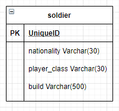
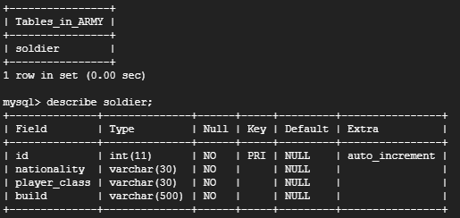

#### Service Architecture
For the app to work smoothly all 4 services had to communicate accordlingly. The diagram below shows the services interact with each other.

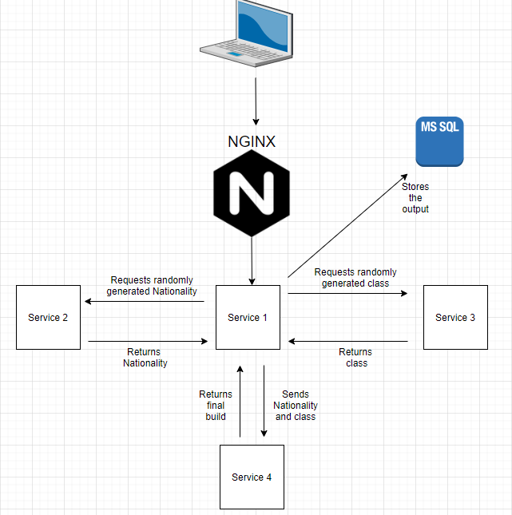

Service 1 sends a 'GET' request to services 2 and 3 in order to retrive a randomly generated nationality and class. Services 2 and 3 produce the random nationality and class and then return this information back to service 1. Service 1 then sends a 'POST' request to services 4 with the generated nationality and class. Services 4 then sends a 'POST' request back to service 1 to return the final build for the Soldier. Additionaly, once services 4 has returned the final results to service 1, service 1 then takes them results and stors them in ther MySQL database.

#### Continous Deployment Pipeline 
Below is a diagram of the project's continous deployment pipeline:

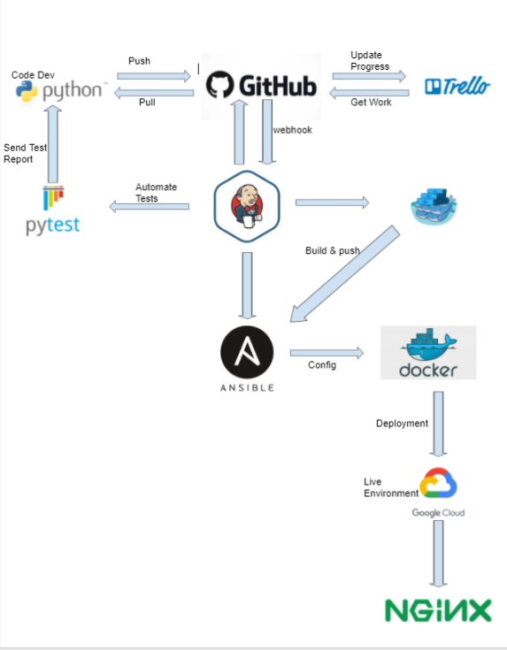

This begins with the development of the application in Visual Studio Code, every change made during the development stage is then pushed up to the project repository in Github. This is where all of the application's files can be stored safely and can be managed accordingly.

#### Jenkins Build Stages
Below is how the pipeline appears on Jenkins:

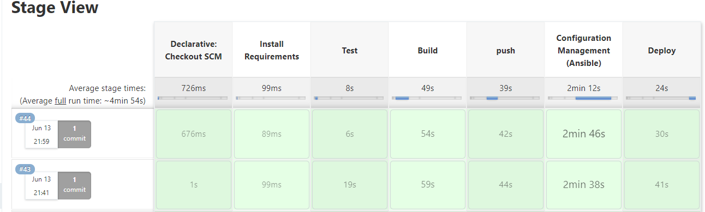

### Project Tracking 
For this project i decided to use trello as my project tracking tool. Below is the screenshot of the board.

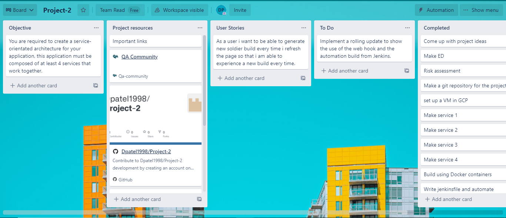

#### Risk Assessment
The following screenshot shows the initial risk assesment done on the 07/06/2021 but later it was revisited on the 10/06/2021 after realising a couple more risks. 

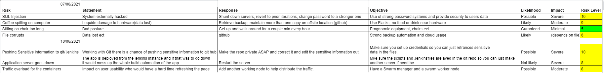

# Application
Below is a screenshot of the home screen of the application.

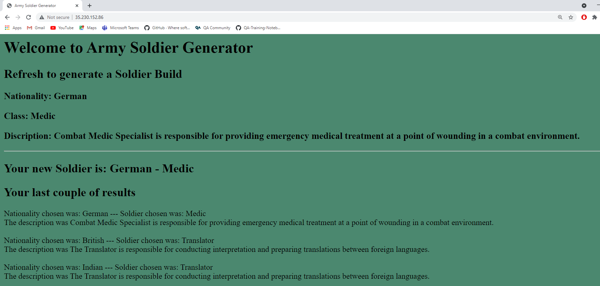

# Unit Testing
Below are screenshots of the tests ran:

## Services 1 Test
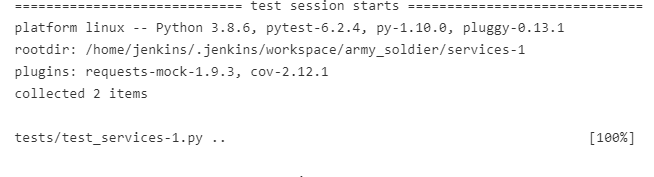

## Services 2 Test 
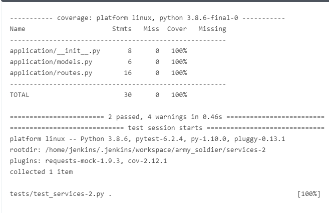

## Services 3 Test 
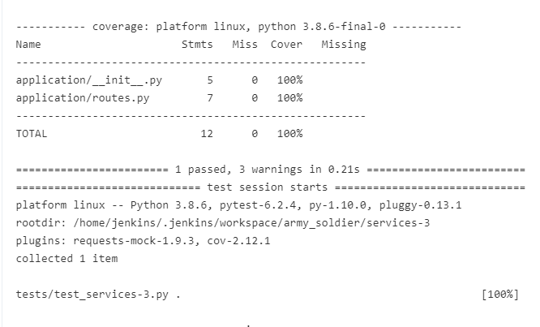

## Services 4 Test 
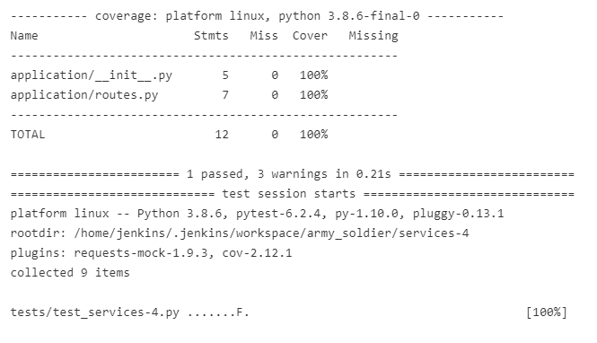

### Future Improvements 
- Have a rating for each build with sub-category rating making it more enjoyable for the end user. 
- adding ranking to the builds and making some builds extra rare again making it more enjoyable for the end user.
- having a login feature so each build can be stored and saved to a user.
